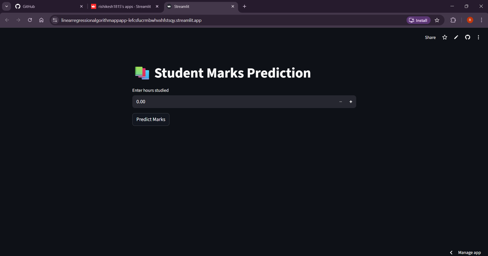

#  Student Marks Prediction — Linear Regression Model

##  Project Overview

This project is a **Supervised Machine Learning application** that predicts student marks based on the number of hours studied.

It demonstrates the **end-to-end ML workflow**, including data preprocessing, model training, evaluation, and deployment as an interactive web application.

This project was built to gain hands-on experience in real-world Machine Learning model development and deployment.

---

##  Problem Statement

Many students want to estimate their expected marks based on study time.

However, there is no simple tool available to quickly predict performance outcomes.

This project solves the problem by providing a **data-driven prediction system** using Linear Regression.

---

##  What This Application Does

• Takes study hours as input  
• Predicts expected student marks  
• Provides instant results through an interactive web interface  

---

##  Machine Learning Approach

### Model Type:
Supervised Learning — Regression

### Algorithm Used:
Linear Regression

The model learns the relationship between:
Input → Hours Studied  
Output → Student Marks  

---

##  Tech Stack

• Python  
• Scikit-learn  
• Pandas  
• NumPy  
• Streamlit  
• Joblib  

---

##  Project Workflow

1. Data collection and preprocessing  
2. Training Linear Regression model  
3. Evaluating model performance  
4. Saving trained model using Joblib  
5. Deploying model using Streamlit web app  

---

##  Model Performance

The model successfully learns the relationship between study hours and marks, providing accurate predictions for unseen data.

---

##  Application Screenshots

### 🔹 Main Interface

---

### 🔹 Prediction Output

---

##  Live Application

Live Demo: (https://linearregressionalgorithmappapp-lefcsfucrmbwhvxhfstsqy.streamlit.app/)

---

##  Learning Outcomes

• Understanding supervised learning concepts  
• Building and training regression models  
• Model persistence using Joblib  
• Deploying ML models as web applications  
• End-to-end ML workflow experience  

---

##  Future Improvements

• Use larger real-world datasets  
• Add multiple input features  
• Implement advanced regression models  
• Deploy using cloud platforms  

---

##  Author

**RISHIKESH S**  
Aspiring Product Manager  

LinkedIn: (https://www.linkedin.com/in/rishikesh-s-77287633b/)

---

##  Project Purpose

This project represents a **hands-on learning experience in supervised Machine Learning** and demonstrates practical implementation of regression modeling in real-world scenarios.
